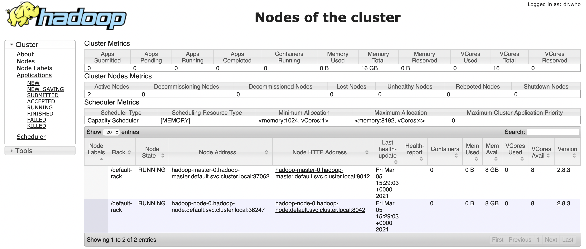
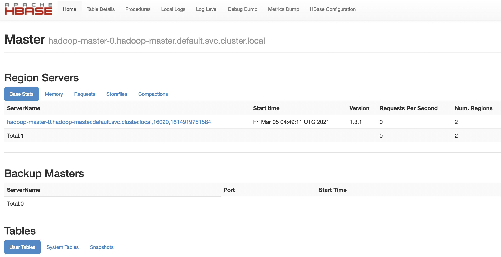
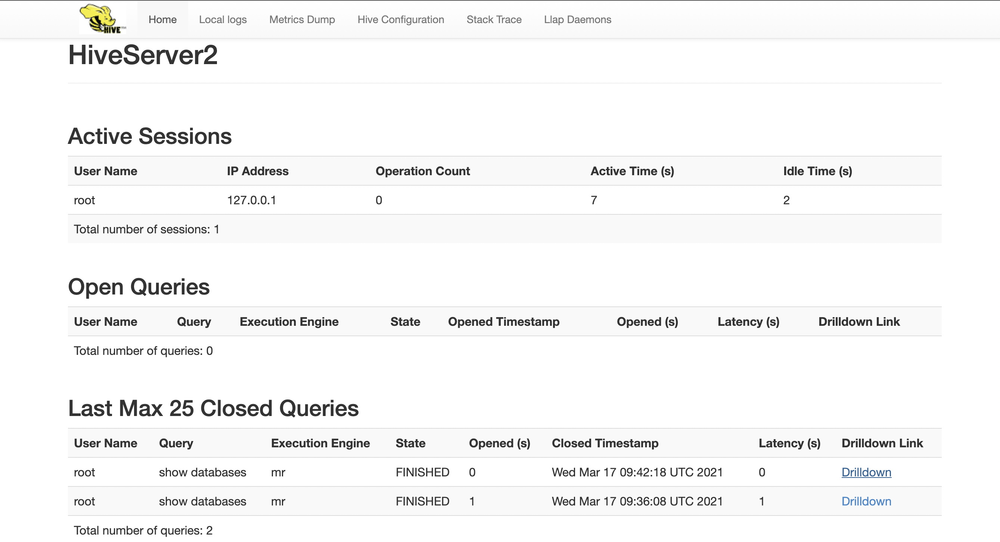

# k8s hadoop simple cluster

use image [izone/hadoop](https://hub.docker.com/r/izone/hadoop/)

cluster/cluster.sh [origin](https://github.com/luvres/hadoop/blob/master/cluster/cluster.sh)

datanode/start.sh [origin](https://github.com/luvres/hadoop/blob/master/cluster/datanode/start.sh)

## images

### datanode

cd ../datanode

docker build -t cclient/hadoop:2.8.3-datanode ./

docker build --build-arg http_proxy= --build-arg https_proxy= -t cclient/hadoop:2.8.3-datanode ./

### namenode

cd ../cluster

docker build -t cclient/hadoop:2.8.3-namenode ./

docker build --build-arg http_proxy= --build-arg https_proxy= -t cclient/hadoop:2.8.3-namenode ./

## deploy

datanode must have started before deploy namenode(namenode ssh datanode to config)

### datanode

kubectl apply -f deploy-datanode.yml

### namenode

kubectl apply -f deploy-namenode.yml

### start hive 

```
kubectl exec -it hadoop-master-0 bash
# init 
cd /opt/hive/bin
/opt/hive/bin/hive --service schemaTool  -initSchema -dbType mysql
# start
nohup /opt/hive/bin/hive --service hiveserver2 &
# connect

/opt/hive/bin/beeline -u jdbc:hive2://127.0.0.1:10000  -nroot -phadoop

0: jdbc:hive2://127.0.0.1:10000> show databases;
+----------------+
| database_name  |
+----------------+
| default        |
+----------------+
1 row selected (1.929 seconds)

```

## show

```bash
$ kubectl get pods
NAME              READY   STATUS    RESTARTS   AGE
hadoop-master-0   1/1     Running   0          10h
hadoop-node-0     1/1     Running   0          10h

$ kubectl get svc
NAME            TYPE        CLUSTER-IP      EXTERNAL-IP   PORT(S)                                                                                                                                                                  AGE
hadoop-master                NodePort       10.96.64.27      <none>        22:32620/TCP,8088:32688/TCP,8042:31507/TCP,50030:32630/TCP,50070:32670/TCP,8888:32488/TCP,4040:31798/TCP,8787:30829/TCP,9000:30760/TCP,60010:32510/TCP,60030:32530/TCP,10000:32000/TCP,10002:32002/TCP   11m
hadoop-node                  ClusterIP      10.100.139.149   <none>        22/TCP                                                             11m
```

## view demo

### hadoop

cluster http://k8s-node-ip:32688



namenode  http://k8s-node-ip:32670


### hbase

hbase-master http://k8s-node-ip:32510



hbase-regionserver http://k8s-node-ip:32530


### hive

hive http://k8s-node-ip:32002



### jupyter

notebook http://k8s-node-ip:32488